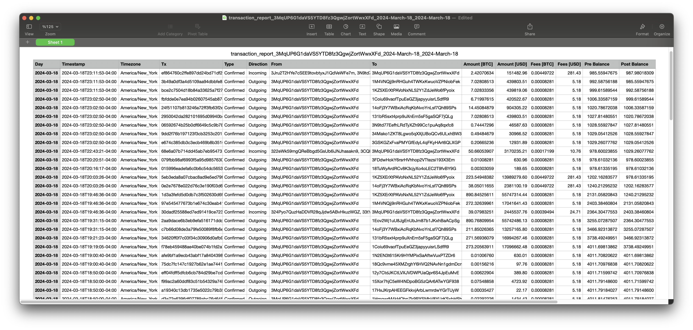

# Bitcoin Transaction Report Generator

## Introduction

This script is designed to fetch and analyze Bitcoin transactions associated with a specific address, utilizing the power of QuickNode's Blockbook RPC add-on. It generates detailed reports within a specified date range, providing insights into transaction history, balances after each transaction, and the USD value of Bitcoin movements. Aimed at developers, financial analysts, and enthusiasts, this tool ensures clarity and compliance in managing Bitcoin transaction data.

For an in-depth guide on how to use this tool, refer to [our comprehensive guide on QuickNode](https://www.quicknode.com/guides/quicknode-products/marketplace/how-to-generate-bitcoin-transaction-reports-with-blockbook).

## Features
- **Balance Calculation**: Calculates the BTC balance before and after each transaction.
- **Transaction Direction**: Identifies whether transactions are incoming or outgoing.
- **Confirmation Status**: Determines whether transactions are confirmed.
- **USD Conversion**: Computes the USD value of each transaction at the time it occurred.
- **Transaction Filtering**: Excludes internal wallet transactions that are not relevant to the address in question.
- **Date Range Filtering**: Generates reports for transactions within a specified date range.

## Prerequisites
Before you begin, ensure you have the following:
- [Python 3.x](https://www.python.org/downloads/) installed on your system.
- A QuickNode account with the [Blockbook RPC](https://marketplace.quicknode.com/add-on/blockbook-rpc-add-on) add-on enabled. 
    > Blockbook RPC is a paid add-on. Please check the details [here](https://marketplace.quicknode.com/add-on/blockbook-rpc-add-on) and compare plans based on your needs.
- A code editor or an IDE (e.g., [VS Code](https://code.visualstudio.com/))

## Setup
1. Clone the repository to your local machine:
```bash
git clone https://github.com/quiknode-labs/qn-guide-examples.git
```

2. Navigate to the project directory:
```bash
cd bitcoin/transaction-report-generator
```

3. Navigate to the preferred programming language directory:
```bash
cd python
```

4. Install the necessary Python packages:
```bash
pip install -r requirements.txt
```

5. Configure your QuickNode endpoint:

- Rename the `.env.example` file to `.env`
- Replace the `YOUR_QUICKNODE_BITCOIN_ENDPOINT_URL` placeholder with your QuickNode Bitcoin HTTP provider URL.

## Usage

The script is designed to be flexible, catering to various user needs, including specifying time ranges and adjusting for time zones when generating Bitcoin transaction reports. Before running the script, you'll need to manually set the variables within `app.py`.

### Setting Up Your Variables

1. Open `app.py` in your preferred text editor and modify the variables at the top of the file:

2. Specify the Bitcoin address you're interested in.

```python
# Define the Bitcoin address for which the report will be generated
address = "YOUR_BITCOIN_ADDRESS_HERE"
```

3. Specify the date range and time zone (Optional). 

- **Date Range:** If you want the report to cover transactions within a specific date range, set the `start_date` and `end_date` variables. These variables are as comments. You can activate it by removing the "#" sign on each line. If you keep them as comments, the script will consider the date range to be the current day.

- **Time Zone:** By default, the script uses the system's local time zone. If you wish to specify a different time zone for interpreting the start and end dates, set the `user_timezone` variable accordingly.

See [`timezones.txt`](../timezones.txt) for possible time zone values.

```python
# Optional date range and time zone for the report
config = {
    # 'start_date': datetime(2024, 3, 18),  # March 18, 2024
    # 'end_date': datetime(2024, 3, 18), # March 18, 2024
    # 'user_timezone': "America/New_York",
}
```

4. After setting your variables, run the `app.py` file.

```python
python app.py
```

## Output

The script generates a CSV file in the current directory with a name of the format It creates a file with a name of the format `transaction_report_{address}_{start_date}_{end_date}.csv`. This CSV file contains detailed information on each transaction, including but not limited to the transaction date, the amount in BTC and USD, and the balance after each transaction, all tailored according to the specified parameters.



## Conclusion

[QuickNode's Blockbook add-on](https://marketplace.quicknode.com/add-on/blockbook-rpc-add-on) makes it easier for developers and businesses to create detailed Bitcoin transaction reports. This script introduces the basics, but there's more you can do. Whether it's for audits, helping with regulatory tasks, or market analysis, the Blockbook add-on simplifies the blockchain data extraction process.

To learn more about how QuickNode is helping auditing firms to pull this type of data from blockchains, please feel free to [reach out to us](https://www.quicknode.com/contact-us); we would love to talk to you!

