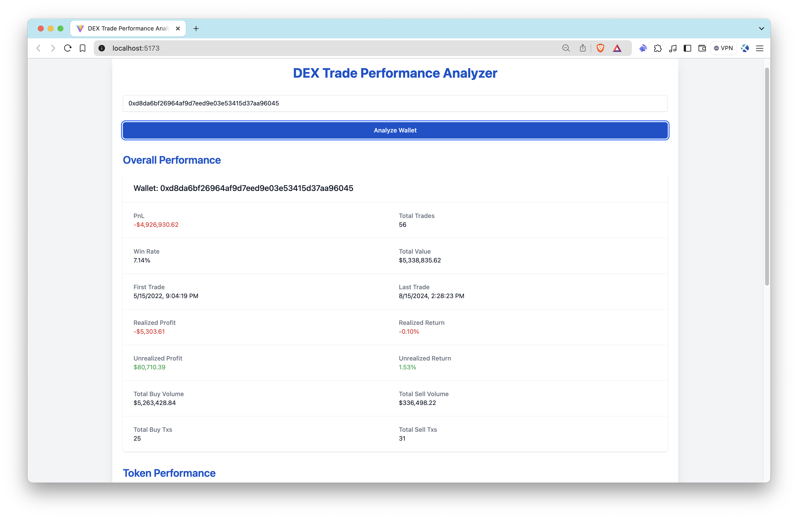

# DEX Trade Performance Analyzer

## Introduction

This application is designed to analyze the trading performance of a crypto wallet, leveraging the capabilities of Syve's [DEX Price Data & Wallet Tracking APIs](https://marketplace.quicknode.com/add-on/syve-dex-price-data-and-wallet-tracking-api). The primary focus of this application is to provide users with detailed insights into wallet trading activities, including profit and loss metrics for each traded token.

For an in-depth guide on how to fetch data and develop further functionalities, refer to [our comprehensive guide on QuickNode](https://www.quicknode.com/guides/quicknode-products/marketplace/how-to-track-dex-wallet-trading-performance).

### Tech Stack

- Frontend Framework/Library: React
- Language: TypeScript
- Build Tool/Development Server: Vite
- Styling: Tailwind CSS

## Features

- **Overall Wallet Performance**: Displays total profit and loss, win rate, and other key metrics using Syve's Wallet Tracking API.
- **Token-Specific Performance**: Provides detailed trading metrics for each token held in the wallet.

## Getting Started

### Prerequisites

Before you begin, ensure you have the following:

- [Node.js](https://nodejs.org/en/) installed on your system.
- A QuickNode account with the [DEX Price Data & Wallet Tracking APIs](https://marketplace.quicknode.com/add-on/syve-dex-price-data-and-wallet-tracking-api) enabled.
- A code editor or an IDE (e.g., [VS Code](https://code.visualstudio.com/))
- [TypeScript](https://www.typescriptlang.org/) and [ts-node](https://typestrong.org/ts-node/)

> You can run the commands below to install TypeScript and ts-node globally to have TypeScript available across all projects.

```bash
npm install -g typescript ts-node
```

### Installation Dependencies

1. Clone the repository to your local machine:

```bash
git clone https://github.com/quiknode-labs/qn-guide-examples.git
```

2. Navigate to the project directory:

```bash
cd sample-dapps/ethereum-dex-trade-performance-analyzer
```

3. Install the necessary dependencies:

```bash
npm install
```

### Setting Environment Variables

Rename `.env.example` to `.env` and replace the `YOUR_QUICKNODE_ENDPOINT_URL` placeholder with your QuickNode Ethereum Node Endpoint. Make sure that the [DEX Price Data & Wallet Tracking APIs](https://marketplace.quicknode.com/add-on/syve-dex-price-data-and-wallet-tracking-api) are enabled.

```env
VITE_QUICKNODE_ENDPOINT="YOUR_QUICKNODE_ENDPOINT_URL"
```

> Please note that while we utilize `dotenv` for environment variable management, sensitive information like endpoints can still be visible on the frontend. This configuration is not recommended for production environments as-is.

### Running the Application

Run the development server:

```bash
npm run dev
```

Open [http://localhost:5173/](http://localhost:5173/) with your browser to see the application.

## Using the App

1. Input a wallet address.
2. Press **Analyze Wallet**.
3. View the overall and token-specific trading performance.

The **Wallet Performance Analyzer** will fetch the data using Syve's Wallet Tracking APIs, and display the results.

Overall Performance            |  Token Specific Performance
:-------------------------:|:-------------------------:
  |  

## Conclusion

Syve's [DEX Price Data & Wallet Tracking APIs](https://marketplace.quicknode.com/add-on/syve-dex-price-data-and-wallet-tracking-api) provide developers with powerful tools for analyzing wallet trading activities. By leveraging these APIs, developers can create applications that deliver valuable insights into crypto trading performance.

[QuickNode](https://quicknode.com/) offers many different marketplace add-ons, providing developers with the resources needed to create robust and feature-rich crypto applications. To learn more about how these APIs and other QuickNode add-ons can benefit your projects, please [contact us](https://www.quicknode.com/contact-us); we're eager to assist you!