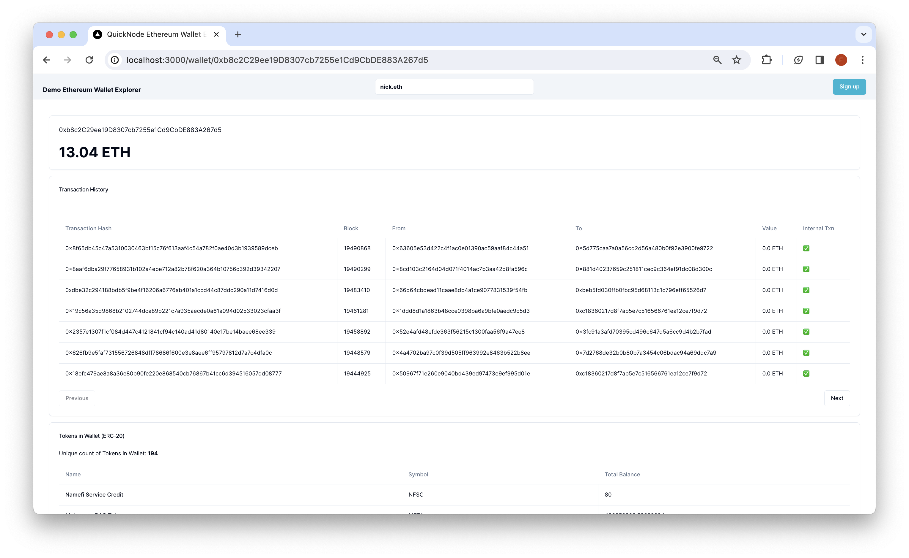

# QuickNode Ethereum Explorer Demo

## Overview

This is a simple demo of how to use your QuickNode Ethereum Node Endpoint and APIs from the QuickNode Marketplace to query the Ethereum blockchain for tokens, transactions, and NFTs for a given wallet.

To run this demo to its full capabilities, you will need both the [`Token and NFT API v2 bundle`](https://marketplace.quicknode.com/add-on/token-and-nft-api-v2-bundle?utm_source=internal&utm_content=courses) (free) and [`Trueblocks Key`](https://marketplace.quicknode.com/add-on/trueblocks-key?utm_source=internal&utm_content=course) (paid) add-ons from the [QuickNode Marketplace](https://www.quicknode.com/marketplace?utm_source=internal&utm_content=course) installed.

The demo uses [Next.js 14](https://nextjs.org/) project bootstrapped with [`create-next-app`](https://github.com/vercel/next.js/tree/canary/packages/create-next-app).

## Getting Started

### Install Dependencies

First, install the dependencies:

```bash
npm install
# or
yarn
# or
pnpm install
# or
bun install
```

### Set Environment Variables

Rename `.env.example` to `.env.local` and update with your QuickNode Ethereum Node Endpoint.

```env
ETHEREUM_RPC_URL=https://example.ethereum-mainnet.quiknode.pro/123456/
NEXT_PUBLIC_ETHEREUM_RPC_URL=https://example.ethereum-mainnet.quiknode.pro/123456/
```

First, run the development server:

```bash
npm run dev
# or
yarn dev
# or
pnpm dev
# or
bun dev
```

Open [http://localhost:3000](http://localhost:3000) with your browser to see the result.

## Using the Dapp

Search for an Ethereum wallet address and press enter. The Dapp will redirect to `/wallet/[address]` and query the Ethereum blockchain for the wallet's token balances, transactions, and NFTs. Results are rendered in respective cards.

### Architecture

```bash
src/
├── app/
│   └── api/
│       └── wallet/
├── components/
    ├── explorer/
    └── header/
```

- `api` - Contains the API routes for the Ethereum RPC calls. These can be accessed from the client via `/api/wallet/[method]?walletAddress=[address]`. These GET requests utilize the [`Ethers`](https://docs.ethers.org/v6/) library, which lets us interact with Ethereum via our RPC URL and helps us parse and decode data, the [`Token and NFT API v2 bundle`](https://marketplace.quicknode.com/add-on/token-and-nft-api-v2-bundle?utm_source=internal&utm_content=courses) add-on from the [QuickNode Marketplace](https://www.quicknode.com/marketplace?utm_source=internal&utm_content=course) to get information about NFTs and ERC-20 Tokens via simple RPC request, and the [`Trueblocks Key`](https://marketplace.quicknode.com/add-on/trueblocks-key?utm_source=internal&utm_content=course) add-on to obtain a complete historical list of appearances (block number, transaction id) for any Ethereum address.

- `components` - Contains the React components for the dapp. 
    - The `explorer` component contains client-side components that call the API routes and render the results.
    - The `header` component contains the search bar for the dapp.

## Deploy on Vercel

[](https://vercel.com/new/clone?repository-url=https%3A%2F%2Fgithub.com%2Fquiknode-labs%2Fqn-guide-examples%2Ftree%2Fmain%2Fsample-dapps%2Fethereum-wallet-explorer&env=ETHEREUM_RPC_URL,NEXT_PUBLIC_ETHEREUM_RPC_URL&envDescription=ETHEREUM_RPC_URL%3A%20Use%20QuickNode%20Ethereum%20Mainnet%20Endpoint%20%7C%20NEXT_PUBLIC_ETHEREUM_RPC_URL%3A%20Your%20Ethereum%20RPC%20URL%20for%20frontend%20uses&envLink=https%3A%2F%2Fdashboard.quicknode.com%2Fendpoints&project-name=ethereum-wallet-explorer&repository-name=ethereum-wallet-explorer&redirect-url=https%3A%2F%2Fdashboard.quicknode.com%2Fendpoints&demo-title=QuickNode%20Starter%20Ethereum%20Wallet%20Explorer&demo-image=https%3A%2F%2Fgithub.com%2Fquiknode-labs%2Fqn-guide-examples%2Fblob%2Fmain%2Fsample-dapps%2Fethereum-wallet-explorer%2Fpublic%2Fdemo1.png)

## Preview 




## Next.js Documentation

To learn more about Next.js, take a look at the following resources:

- [Next.js Documentation](https://nextjs.org/docs) - learn about Next.js features and API.
- [Learn Next.js](https://nextjs.org/learn) - an interactive Next.js tutorial.

You can check out [the Next.js GitHub repository](https://github.com/vercel/next.js/) - your feedback and contributions are welcome!