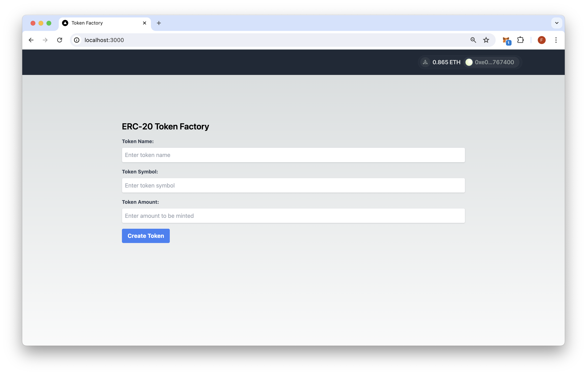

# QuickNode EVM Token Factory Demo

## Overview

This simple demo lets you create an ERC-20 token on any EVM-compatible blockchain. The demo will allow you to set an ERC-20 token's `name`, `symbol`, and `initial supply`. Current supported networks include Sepolia and Holesky (feel free to add more!)



The demo uses [Next.js 14](https://nextjs.org/) project bootstrapped with [`create-next-app`](https://github.com/vercel/next.js/tree/canary/packages/create-next-app).

## Getting Started

### Install Dependencies

Open the project directory:

```bash
cd sample-dapps/evm-token-maker
```

Then, install the dependencies:

```bash
npm install
# or
yarn
# or
pnpm install
# or
bun install
```

First, run the development server:

```bash
npm run dev
# or
yarn dev
# or
pnpm dev
# or
bun dev
```

Open [http://localhost:3000](http://localhost:3000) with your browser to see the app.

## Using the Dapp

1. Connect your wallet
    - Make sure you have enough ETH (or other native EVM gas token) in your wallet to cover the create token transaction
    - If you are using Testnet, you can get free ETH from the [QuickNode Faucet](https://faucet.quicknode.com/)
2. Click "Create Token" and confirm the transaction to create the ERC-2O token!

### Architecture

```bash
src/
├── app/
│   ├── page.tsx # Main page
│   └── layout.tsx # Import the Web3Modal component
│   └── api/
│       └── evm/
│           └── createToken/route.ts   # Create New ERC-20 Transaction
└── components/
|    ├── Connect.tsx     # Web3Modal Component
|    ├── Navbar.tsx              # Navbar component
     └── [supporting components]
└── context/
    ├── web3modal.tsx     # Wallet Adapter Context providers 
└── smart_contracts/
│   └── abi/
│       └── factory.json  # Factory ABI
│   └── Factory.sol       # Token Factory 
│   └── ERC20.sol         # Token Details
```

## Smart Contracts

Each chain must have the Factory smart contract deployed to create ERC-20 tokens on that chain.

**Factory**: The Factory contract inherits the ERC20.sol smart contract and acts as a Factory for creating and tracking new ERC-20 tokens.

**Token**: This is an ERC-20 smart contract defined by the OpenZeppelin standard and includes a `mint` and `transferOwnership` function call in the constructor upon deployment.

**Deployed Addresses**:

- Sepolia: 0x28D99a0A1B430B3669B8A2799dCDd7d332ceDb1C
- Holesky: 0x5fCCa8dCeD28B13f2924CB78B934Ab0AF445542A

## Next.js Documentation

To learn more about Next.js, take a look at the following resources:

- [Next.js Documentation](https://nextjs.org/docs) - learn about Next.js features and API.
- [Learn Next.js](https://nextjs.org/learn) - an interactive Next.js tutorial.

You can check out [the Next.js GitHub repository](https://github.com/vercel/next.js/) - your feedback and contributions are welcome!

